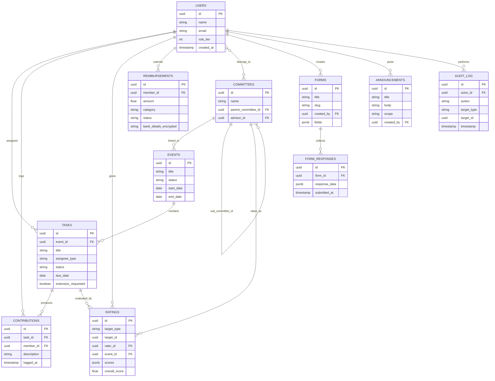

# LEADS All-in-One Dashboard — Data Model & ERD
**LEADS Next Gen Centre | MSRUAS | Version 1.0 | August 2026**

---

## Version History

| Version | Date | Author | Change |
|---------|------|--------|--------|
| v1.0 | Aug 2026 | Kayomarz Pavri | Initial document |

---

## 1. Entity-Relationship Diagram

## 2. Key Relationship Notes

- **TASKS.event_id is nullable** — this is what allows a task to be standalone (no event) or event-linked. Every query that lists "my tasks" must handle both cases.
- **RATINGS.target_type is a discriminator** — a single ratings table serves both individual ratings (`target_type = 'individual'`, `target_id` → users.id) and committee ratings (`target_type = 'committee'`, `target_id` → committees.id). This avoids two parallel rating systems that could drift out of sync.
- **COMMITTEES.parent_committee_id** is self-referencing, enabling sub-committees under a parent committee without a separate table.
- **FORM_RESPONSES has no required link to USERS** — public form respondents are not required to have an account; `respondent_email` is optional metadata only, never an FK to `users`.
- **AUDIT_LOG is append-only** — no UPDATE or DELETE policy should ever be granted on this table, including to the super user, to preserve its integrity as a record.

## 3. Indexing Notes (for the developer)

- Index `tasks.assignee_ids` (if using an array column) or the join table (if normalized) — this is the most frequently queried field ("my tasks")
- Index `ratings.target_id` + `target_type` composite — reports query this heavily
- Index `form_responses.form_id` — response exports filter by form
